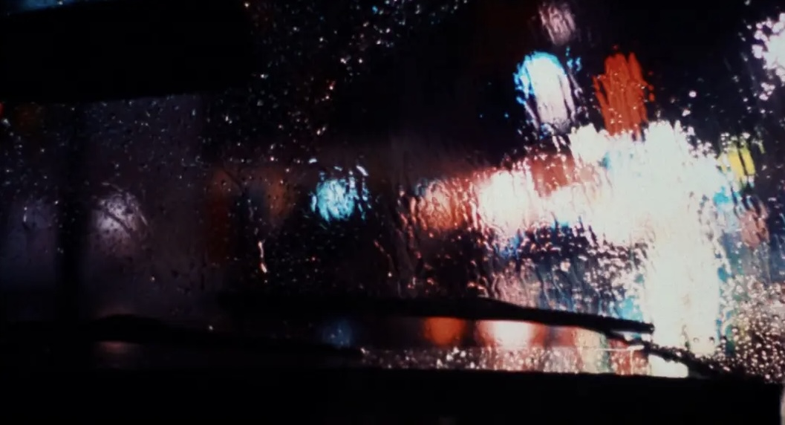

# xliu0002_9013_tu3

### Part 1

During rainy day, looking through a glass window presents a scene similar to Image 1, where the refraction of raindrops creates a blurry effect. This serves as my inspiration, as any image can be transformed into compositions of small colored circles. Images gradually form through these colored circles, resulting in a blurred effect, replacing intricate details with pixelated blocks. I believe it’s a beneficial technique because it aligns with my chosen image of geometric abstract artwork for the project. This technique effectively achieves an abstract visual effect and possesses dynamic aesthetics.

The Screenshot from *Taxi Driver*

### Part 2

First, create a canvas and adjust the image size to fit the screen. Then, use the "draw" function to obtain the colors of random pixels constituting the image by their pixel coordinates. Finally, draw squares to represent the pixels, gradually generating the image. Here is the link to the example implementation: https://happycoding.io/tutorials/p5js/images/pixel-painter 

